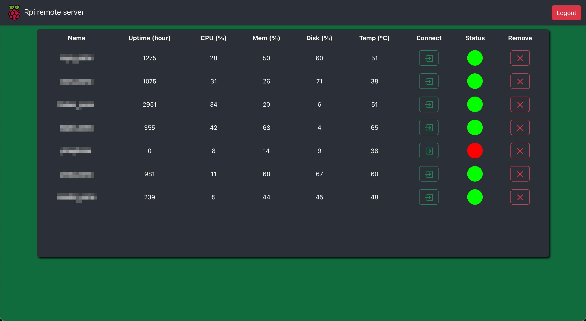
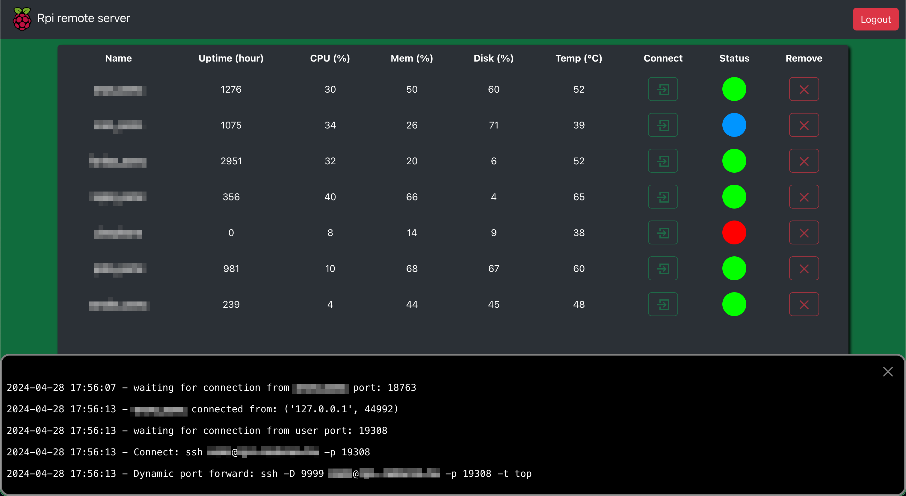
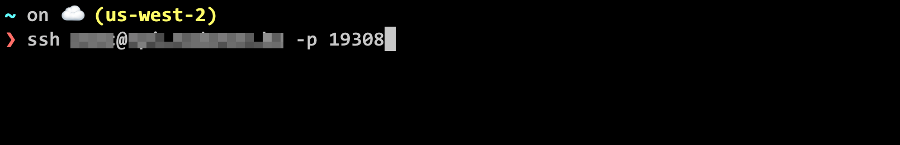

# Rpi Remote server

This web application provide accesibility to clients via port forwarding from machines which running [rpi_remote_client](https://github.com/radaron/rpi_remote_client). The application provides easy to access connection to the remote devices.
The default port is 22 in client settings, so you can use ssh to connect to the remote clients by default.

When login to the page you will see the connected clients with metrics and statuses


After clicking on connect button a terminal will shown where the connection details can be track. With connection examples.


Then you can connect eg.: ssh in your local terminal



## Installation

### Prerequisites
* rust
* libffi
* gcc
* openssl

### Install dependencies
```
make install
```

### Generate secret
Needs for session cookies
```
make generate-secret
```

### Create user
Needs to login the manage page
```
make add-user
```

### Create service
```
cd <path of cloned repo>
```
```
echo "[Unit]
Description=rpi_remote server
After=multi-user.target
Conflicts=getty@tty1.service
[Service]
User=${USER}
Type=simple
Environment="LC_ALL=C.UTF-8"
Environment="LANG=C.UTF-8"
ExecStart=$(pwd)/.venv/bin/gunicorn
WorkingDirectory=$(pwd)
Restart=on-failure
[Install]
WantedBy=multi-user.target" | sudo tee /etc/systemd/system/rpi-remote-server.service
```
```
sudo systemctl daemon-reload
sudo systemctl enable rpi-remote-server.service
sudo systemctl start rpi-remote-server.service
```

### Configuration

#### config.ini
generated automatically after first run
``` ini
[connection]
# the application randomly select port for receive connection from remote and for user within this range
port_range_start = 10000
port_range_end = 20000
custom_messages = [
  # custom message displays after remote client connected and the {port} replaced with the listening port
  "This is a custom message",
  "This is a custom message displaying the {port} where user can connect",
  "Connect: ssh root@example.com -p {port}",
  "Dynamic port forward: ssh -D 9999 root@example.com -p {port} -t top"
  ]
```

#### Firewall
Enable the port range in firewall where the connection can happen default is 10000-20000

#### Configure webserver (if needed)
Nginx example
``` nginx
upstream rpi_remote_server {
      server 127.0.0.1:8888;
}

server {
  server_name example.com;

  location /rpi/ {
    proxy_pass http://rpi_remote_server/rpi/;
  }

  location / {
    return 301 http://$server_name/rpi/manage;
  }

  location /rpi/socket.io {
    proxy_set_header X-Forwarded-For $proxy_add_x_forwarded_for;
    proxy_set_header Host $host;

    proxy_pass http://rpi_remote_server/rpi/socket.io;

    proxy_http_version 1.1;
    proxy_set_header Upgrade $http_upgrade;
    proxy_set_header Connection "upgrade";
  }
}
```

## Check logs
```
journalctl -fu rpi-remote-server
```

## Development

### Install dev requirements

```
make install-dev
```

### Lint code
Backend
```
make lint
```
Frontend
```
cd frontend && pnpm lint
```

### Start dev
Backend
```
make start-dev
```
Frontend
```
cd frontend && pnpm start
```
