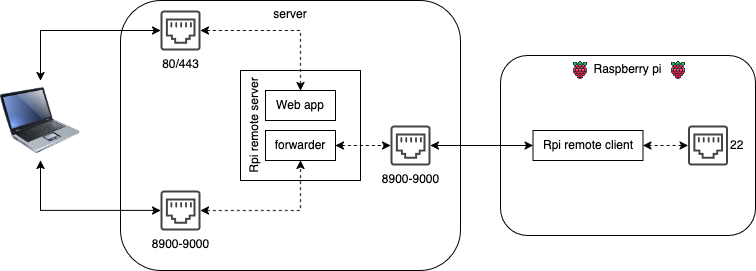
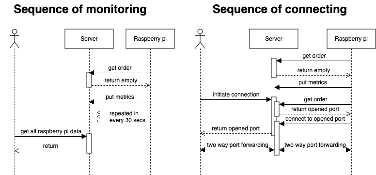

# Rpi Remote server

This web application provide accesibility to clients via port forwarding from machines which running [rpi_remote_client](https://github.com/radaron/rpi_remote_client). The application provides easy to access connection to the remote devices.
The default port is 22 in client settings, so you can use ssh to connect to the remote clients by default.

When login to the page you will see the connected clients with metrics and statuses


After clicking on connect button a terminal will shown where the connection details can be track. With connection examples.


Then you can connect eg.: ssh in your local terminal


### How it works
[](https://viewer.diagrams.net/?lightbox=1&highlight=0000ff&nav=1&title=blocks.png#Uhttps%3A%2F%2Fraw.githubusercontent.com%2Fradaron%2Frpi_remote_server%2Fmaster%2Fdoc%2Fimages%2Fblocks.png)
[](https://viewer.diagrams.net/?lightbox=1&highlight=0000ff&nav=1&title=sequence.png#Uhttps%3A%2F%2Fraw.githubusercontent.com%2Fradaron%2Frpi_remote_server%2Fmaster%2Fdoc%2Fimages%2Fsequence.png)

## Installation

### Install dependencies
```
make install
```

### Configuration

The configs added as environment variables. See the .env file.

``` sh
PORT_RANGE_START = 8900
PORT_RANGE_END = 9000
# custom messages separated by `;`. Displays after remote client connected.
# The {port} replaced with the listening port.
# The {username} replaced with the client ssh username.
CUSTOM_MESSAGES = "Connect: ssh {username}@example.com -p {port};Dynamic port forward: ssh -D 9999 {username}@example.com -p {port} -t top"
ADMIN_USERNAME = "admin"
ADMIN_PASSWORD = "admin"
```

#### Firewall
Enable the port range in firewall where the connection can happen default is 8900-9000

#### Configure webserver (if needed)
Nginx example
``` nginx
upstream rpi_remote_server {
      server 127.0.0.1:8888;
}

server {
  server_name example.com;

  location / {
    proxy_pass http://rpi_remote_server/;
  }

  location / {
    return 301 http://$server_name/manage;
  }

  location /socket.io {
    proxy_set_header X-Forwarded-For $proxy_add_x_forwarded_for;
    proxy_set_header Host $host;

    proxy_pass http://rpi_remote_server/socket.io;

    proxy_http_version 1.1;
    proxy_set_header Upgrade $http_upgrade;
    proxy_set_header Connection "upgrade";
  }
}
```

## Development

### Install dev requirements

```
make install-dev
```

### Lint code
Backend
```
make lint
```
Frontend
```
cd frontend && pnpm lint
```

### Start dev
Backend
```
make start-dev
```
Frontend
```
cd frontend && pnpm start
```
